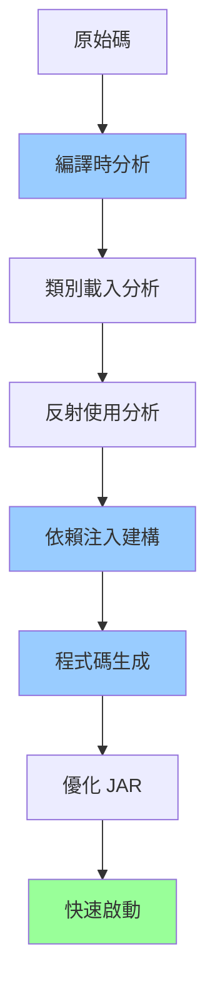

# Quarkus Hello World 應用程式

這是一個使用 Quarkus 框架建立的簡單 Hello World Maven 應用程式。

## 需求

- Java 17 或更高版本
- Maven 3.8.1 或更高版本

## Maven 啟動指令

### 開發模式（熱重載）

```bash
mvn quarkus:dev
```

應用程式將在 `http://localhost:8080` 啟動，並支援熱重載功能。

### 編譯專案

```bash
mvn compile
```

### 執行測試

```bash
mvn test
```

### 清理並建置

```bash
mvn clean package
```

### 執行應用程式

```bash
mvn quarkus:dev
```

或使用已建置的 JAR 檔案：

```bash
java -jar target/quarkus-app/quarkus-run.jar
```

## 測試端點

- 訪問 `http://localhost:8080/hello` 應該會看到 "Hello World!" 訊息
- 訪問 `http://localhost:8080/hello/greeting` 應該會看到 "Greeting!" 訊息

## 建置應用程式

### 建置 JAR 檔案

```bash
mvn clean package
```

### 執行 JAR 檔案

```bash
java -jar target/quarkus-app/quarkus-run.jar
```

## 專案結構

```
.
├── pom.xml                          # Maven 配置檔案
├── src/
│   ├── main/
│   │   ├── java/
│   │   │   └── com/
│   │   │       └── example/
│   │   │           └── HelloWorldResource.java  # REST 端點
│   │   └── resources/
│   │       └── application.yaml                  # 應用程式配置
│   └── test/
│       └── java/                                  # 測試程式碼
└── README.md
```

## Quarkus 無伺服器架構

Quarkus 採用**嵌入式 HTTP 伺服器**架構，不需要外部應用程式伺服器（如 Tomcat、WildFly）。這使得應用程式可以：

- **快速啟動**：啟動時間通常 < 1 秒（JVM 模式）
- **低記憶體佔用**：比傳統應用程式伺服器節省 50-70% 記憶體
- **單一 JAR 部署**：所有依賴都打包在一個可執行 JAR 中
- **原生編譯支援**：可編譯成原生可執行檔，啟動時間 < 50 毫秒

### 架構對比

#### 傳統架構（需要外部伺服器）


#### Quarkus 架構（嵌入式伺服器）


### 編譯時優化流程



## 與其他框架比較

詳細的 Spring Boot vs Quarkus 架構比較請參考：[Spring Boot vs Quarkus 比較文檔](./SPRINGBOOT_VS_QUARKUS.md)

該文檔包含：
- 架構差異詳細說明
- 啟動流程和記憶體使用對比圖表
- 效能數據對比
- 使用場景建議
- 開發體驗比較

### 快速參考

- [Quarkus 官方文件](https://quarkus.io/)
- [Spring Boot 與 Quarkus 官方比較](https://quarkus.io/guides/spring-boot-comparison)

## 技術棧

- **Quarkus** 3.6.0 - 超音速、亞原子 Java 框架
- **RESTEasy Reactive** - JAX-RS 實作，使用反應式程式設計模型
- **Vert.x/Netty** - 嵌入式 HTTP 伺服器（事件驅動、非阻塞）
- **Quarkus Arc** - CDI 依賴注入容器
- **Maven** - 專案管理工具

