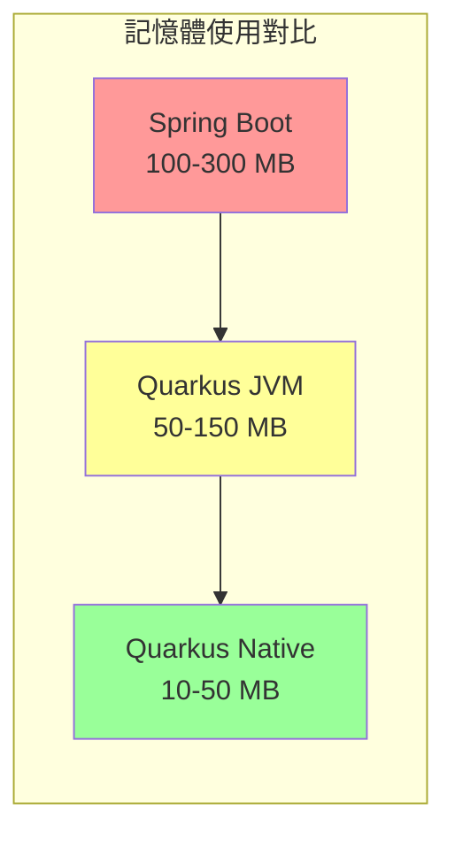

# Spring Boot vs Quarkus 架構比較

本文檔詳細比較 Spring Boot 與 Quarkus 的架構差異、效能特點和使用場景。

## 相似之處

1. **嵌入式伺服器**：兩者都使用嵌入式 HTTP 伺服器
   - Spring Boot：內建 Tomcat（或 Jetty/Undertow）
   - Quarkus：內建 Vert.x/Netty

2. **單一 JAR 部署**：都可打包成可執行 JAR

3. **不需要外部容器**：都可直接 `java -jar` 執行

## 主要差異

### 1. 編譯時 vs 運行時處理

#### Spring Boot（運行時為主）

```
編譯 → JAR → 運行時載入類別 → 反射掃描 → 建立 Bean → 啟動伺服器
```

- 大部分工作在運行時進行
- 使用反射動態載入類別
- 啟動時間：通常 3-10 秒

#### Quarkus（編譯時為主）

```
編譯時分析 → 程式碼生成 → 優化 → JAR → 直接啟動伺服器
```

- 大部分工作在編譯時完成
- 預先分析類別、依賴、反射使用
- 啟動時間：通常 < 1 秒（JVM 模式）

### 2. HTTP 伺服器架構

#### Spring Boot - Tomcat

- 傳統 Servlet 容器
- 基於 Servlet API（阻塞式 I/O）
- 每個請求一個執行緒（預設）
- 適合傳統 Web 應用

#### Quarkus - Vert.x/Netty

- 事件驅動、非阻塞
- 反應式架構
- 少量執行緒處理大量請求
- 適合高併發、低延遲場景

### 3. 記憶體使用

#### Spring Boot

- 典型 JVM 應用：100-300 MB（堆記憶體）
- Tomcat 本身需要一定記憶體

#### Quarkus

- JVM 模式：50-150 MB
- 原生模式：10-50 MB（使用 GraalVM）
- 更小的記憶體佔用

### 4. 原生編譯支援

#### Spring Boot

- 支援 GraalVM 原生編譯（Spring Native）
- 需要額外配置
- 部分功能受限

#### Quarkus

- 原生編譯為核心功能
- 編譯時優化針對原生編譯設計
- 原生模式啟動時間：< 50 毫秒

## 啟動流程對比

```mermaid
graph TB
    subgraph SpringBoot["Spring Boot 啟動流程"]
        SB1[編譯 JAR] --> SB2[運行時載入類別]
        SB2 --> SB3[反射掃描組件]
        SB3 --> SB4[建立 Bean 容器]
        SB4 --> SB5[啟動 Tomcat]
        SB5 --> SB6[處理請求]
        SB6 --> SB7[啟動時間: 3-10秒]
    end
    
    subgraph Quarkus["Quarkus 啟動流程"]
        Q1[編譯時分析] --> Q2[程式碼生成]
        Q2 --> Q3[優化 JAR]
        Q3 --> Q4[直接啟動 Vert.x]
        Q4 --> Q5[處理請求]
        Q5 --> Q6[啟動時間: <1秒]
    end
    
    style SB7 fill:#ff9999
    style Q6 fill:#99ff99
```



## 記憶體使用對比



## 實際效能對比（典型場景）

| 特性 | Spring Boot | Quarkus |
|------|-------------|---------|
| 啟動時間（JVM） | 3-10 秒 | < 1 秒 |
| 啟動時間（原生） | 0.5-2 秒 | < 50 毫秒 |
| 記憶體（JVM） | 100-300 MB | 50-150 MB |
| 記憶體（原生） | 50-100 MB | 10-50 MB |
| 首次請求延遲 | 較高 | 極低 |

## 使用場景建議

### 選擇 Spring Boot 如果：

- 需要豐富的 Spring 生態系統
- 團隊熟悉 Spring
- 傳統企業應用
- 需要 Spring Data、Spring Security 等
- 需要大量的第三方整合

### 選擇 Quarkus 如果：

- 需要極快啟動（微服務、Serverless、容器）
- 需要低記憶體佔用
- 需要高併發、低延遲
- 考慮原生編譯
- 雲原生、Kubernetes 環境
- 容器化部署（Docker、Kubernetes）

## 開發體驗對比

### Spring Boot

```java
@RestController
public class HelloController {
    @GetMapping("/hello")
    public String hello() {
        return "Hello";
    }
}
```

- 熱重載需要 DevTools
- 啟動較慢
- 豐富的註解和自動配置

### Quarkus

```java
@Path("/hello")
public class HelloResource {
    @GET
    public String hello() {
        return "Hello";
    }
}
```

- 內建超快熱重載（`quarkus:dev`）
- 啟動極快
- 編譯時驗證和優化

## 依賴注入容器

### Spring Boot

- Spring IoC 容器
- 運行時建立 Bean
- 功能豐富但較重

### Quarkus

- CDI（Contexts and Dependency Injection）
- 編譯時建立 Bean 圖
- 輕量且快速

## 相關資源

- [Quarkus 官方文件](https://quarkus.io/)
- [Spring Boot 與 Quarkus 架構差異比較](https://quarkus.io/guides/spring-boot-comparison)
- [Quarkus vs Spring Boot 效能比較](https://quarkus.io/blog/quarkus-vs-spring-boot-performance/)
- [Quarkus 原生編譯指南](https://quarkus.io/guides/building-native-image)
- [Spring Boot 官方文件](https://spring.io/projects/spring-boot)

## 總結

兩者都使用嵌入式伺服器，但：

1. **Spring Boot**：成熟、生態豐富、適合傳統應用
2. **Quarkus**：編譯時優化、啟動快、記憶體少、適合雲原生

Quarkus 的設計目標是「超音速、亞原子」Java，特別適合微服務和雲原生場景；Spring Boot 更適合傳統企業應用和需要豐富 Spring 生態的專案。

選擇哪個框架取決於您的具體需求、團隊經驗和專案目標。

